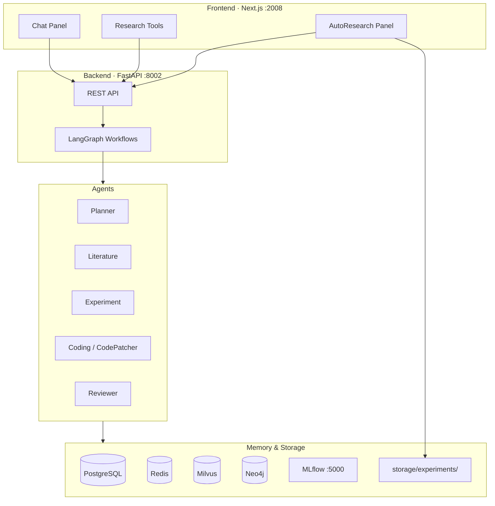

# AI Research OS

<p align="center">
  <strong>AI 驱动的自动化科研工作平台</strong><br/>
  多 Agent 协作 · 文献调研 · 实验循环 · 论文生成
</p>

<p align="center">
  <a href="#快速开始">快速开始</a> ·
  <a href="#架构">架构</a> ·
  <a href="#autoresearch-实验循环">AutoResearch</a> ·
  <a href="#api-概览">API</a> ·
  <a href="AI_Research_OS_PRD.md">PRD</a>
</p>

---

从研究想法到论文草稿，AI Research OS 用多 Agent 编排完成完整科研闭环：

**想法 → 文献调研 → 知识沉淀 → 实验设计 → 代码实现 → 自动实验 → 结果分析 → 论文生成**


## 功能亮点

| 模块 | 能力 |
|------|------|
| **科研对话** | 意图路由至 Planner / Literature / General Agent |
| **研究规划** | 自动生成 Research Roadmap、任务拆解、时间线 |
| **论文检索** | arXiv 搜索、摘要、知识抽取 |
| **知识图谱** | Paper / Method / Dataset / Model 关系（Neo4j） |
| **实验设计** | Baseline、指标、Ablation 方案（Experiment Agent） |
| **代码生成** | 实验脚手架与 `train.py`（Coding Agent） |
| **AutoResearch** | patch → train → evaluate → keep/discard 迭代优化 |
| **AI Scientist** | 一键全自动：Idea → AutoResearch → Analyze → Paper |
| **MLflow** | 实验指标与代码快照追踪 |

### 前端 UI

- 简约风格侧边栏 + 亮/暗主题
- 对话框内可选工具：**深度研究**、**Canvas 画板**、**科研工具**
- 科研工具抽屉：研究规划、论文检索、实验设计、**AutoResearch 面板**

## 架构



## 快速开始

### 环境要求

| 组件 | 版本 |
|------|------|
| Python | 3.10+（推荐 Conda `base`） |
| Node.js | **20 LTS**（项目内置 `tools/node20`） |
| Docker | 可选，用于 PostgreSQL / Redis / Milvus / Neo4j / MLflow |

### 1. 配置

```bash
cp .env.example .env
# 编辑 .env，填入 OPENAI_API_KEY（可选，无 Key 时降级为离线提示）
```

### 2. 启动基础设施

```bash
docker compose up -d postgres redis milvus neo4j mlflow
```

> 基础设施未启动时，后端仍可运行（降级模式），但项目持久化、Redis 会话、MLflow 追踪不可用。

### 3. 启动后端

```bash
conda activate base
cd backend
pip install -r requirements.txt
uvicorn app.main:app --reload --port 8002
```

### 4. 启动前端

**Windows（推荐）：**

```powershell
.\scripts\start-frontend.ps1
```

**或手动：**

```bash
cd frontend
npm install
npm run dev
```

访问 **http://localhost:2008**

### 一键 Docker

```bash
docker compose up -d
```

## 服务端口

| 服务 | 端口 | 说明 |
|------|------|------|
| Frontend | **2008** | Next.js UI |
| Backend | **8002** | FastAPI · [Swagger](http://localhost:8002/docs) |
| PostgreSQL | 5432 | 项目与对话持久化 |
| Redis | 6379 | 短期会话记忆 |
| Milvus | 19530 | 向量检索 |
| Neo4j | 7474 / 7687 | 知识图谱 · [Browser](http://localhost:7474) |
| MLflow | 5000 | 实验追踪 · [UI](http://localhost:5000) |

前端默认通过 Next.js 代理 `/backend/*` → `localhost:8002`，无需额外配置 CORS。

## AutoResearch 实验循环

参考 [karpathy/autoresearch](https://github.com/karpathy/autoresearch) 设计：Agent 在固定训练预算内自动迭代优化 `train.py`。

```
program.md (人类指令)     prepare.py (固定，数据准备)
        │                          │
        └──────────┬───────────────┘
                   ▼
         ┌─ patch train.py ──► train (固定时长) ──► val_bpb
         │                                              │
         │         ┌──────── keep (更优) ◄──────────────┤
         └─────────┤                                    │
                   └──────── discard (回滚) ◄───────────┘
                              │
                              └── 重复，直到 max_iterations
```

| 概念 | 说明 |
|------|------|
| **固定文件** | `prepare.py`、`program.md` — Agent 不可改 |
| **可改文件** | `train.py` — CodePatcher 唯一修改目标 |
| **训练预算** | 默认 300s/轮（`AUTORESEARCH_TRAIN_BUDGET_SECONDS`） |
| **主指标** | `val_bpb` — 越低越好 |
| **决策** | 优于历史最优 → keep；否则 discard 回滚 |

### 实验目录

```
storage/experiments/{experiment_id}/
├── program.md          # 研究指令
├── prepare.py            # 数据准备（一次性）
├── train.py              # Agent 迭代修改
├── best/train.py         # 当前最优快照
└── runs/iter_000/        # 每轮 metrics + 日志
```

### API 示例

```bash
# 初始化工作区
curl -X POST http://localhost:8002/api/v1/experiments/autoresearch/init \
  -H "Content-Type: application/json" \
  -d '{"topic": "优化小型 LM 的 val_bpb", "train_budget_seconds": 300, "max_iterations": 12}'

# 运行循环
curl -X POST http://localhost:8002/api/v1/experiments/{experiment_id}/autoresearch \
  -H "Content-Type: application/json" \
  -d '{"max_iterations": 5}'

# 查看迭代历史
curl http://localhost:8002/api/v1/experiments/{experiment_id}/iterations
```

### 前端入口

**科研工具** 抽屉 → **AutoResearch** 标签 → 输入主题 → 启动

## API 概览

| 方法 | 路径 | 说明 |
|------|------|------|
| `GET` | `/health` | 健康检查 |
| `POST` | `/api/v1/chat` | 科研对话 |
| `POST` | `/api/v1/research/plan` | 研究规划 |
| `POST` | `/api/v1/papers/search` | arXiv 论文搜索 |
| `POST` | `/api/v1/papers/summarize` | 论文摘要 |
| `GET` | `/api/v1/knowledge/graph` | 知识图谱 |
| `POST` | `/api/v1/experiments/design` | 实验方案设计 |
| `POST` | `/api/v1/experiments/code` | 生成实验代码 |
| `POST` | `/api/v1/experiments/run` | 单次运行实验 |
| `POST` | `/api/v1/experiments/autoresearch/init` | 初始化 AutoResearch |
| `POST` | `/api/v1/experiments/{id}/autoresearch` | 运行 AutoResearch 循环 |
| `GET` | `/api/v1/experiments/{id}/iterations` | 迭代历史 |
| `POST` | `/api/v1/scientist/run` | AI Scientist 全自动闭环 |
| `GET` | `/api/v1/scientist/runs` | Scientist 运行记录 |

完整文档：**http://localhost:8002/docs**

## 项目结构

```
research_ai/
├── backend/
│   ├── app/
│   │   ├── agents/          # Planner, Literature, Experiment, Coding, CodePatcher…
│   │   ├── api/routes/      # REST 路由
│   │   ├── database/        # PostgreSQL, Redis, Milvus, Neo4j
│   │   ├── tools/           # 论文检索, experiment_runner, MLflow, 模板
│   │   └── workflows/       # research_graph, scientist_loop, autoresearch_loop
│   └── tests/
├── frontend/
│   ├── components/          # ChatPanel, Sidebar, AutoResearchPanel…
│   └── lib/api.ts           # API 客户端（/backend 代理）
├── storage/                 # 论文 PDF、实验工作区
├── scripts/
│   └── start-frontend.ps1   # Node 20 启动脚本
├── tools/node20/            # 便携 Node 20（Windows）
├── docker-compose.yml
└── AI_Research_OS_PRD.md
```

## 配置说明

| 变量 | 默认值 | 说明 |
|------|--------|------|
| `OPENAI_API_KEY` | — | LLM API Key（可选） |
| `OPENAI_MODEL` | `gpt-4o-mini` | 对话与 Agent 模型 |
| `BACKEND_PORT` | `8002` | 后端端口 |
| `MLFLOW_TRACKING_URI` | `http://localhost:5000` | MLflow 地址 |
| `AUTORESEARCH_MAX_ITERATIONS` | `12` | 默认最大迭代轮数 |
| `AUTORESEARCH_TRAIN_BUDGET_SECONDS` | `300` | 每轮训练预算（秒） |

详见 [`.env.example`](.env.example)

## 开发与测试

```bash
# 后端测试
cd backend
pytest tests/ -v

# 前端构建
cd frontend
npm run build
```

后端在无 PostgreSQL / Redis / API Key 时自动**降级运行**，适合本地快速体验 UI 与 AutoResearch mock 训练。

## 路线图

- [x] 科研助手：Chat、Planner、Paper Search、Vector DB
- [x] 知识图谱、Experiment/Coding Agent、MLflow
- [x] AI Scientist Loop
- [x] AutoResearch 实验循环（autoresearch 风格）
- [x] GPU 沙箱训练、真实 nanochat 集成
- [x] 实验 Docker 隔离、流式 Scientist 进度

## 参考项目

| 项目 | 关联 |
|------|------|
| [karpathy/autoresearch](https://github.com/karpathy/autoresearch) | AutoResearch 循环、固定训练预算、val_bpb |
| [LangGraph](https://github.com/langchain-ai/langgraph) | Agent 工作流编排 |
| [MLflow](https://github.com/mlflow/mlflow) | 实验追踪 |

## 模块文档

- [Backend README](backend/README.md)
- [Frontend README](frontend/README.md)
- [Agents README](backend/app/agents/README.md)
- [Database README](backend/app/database/README.md)
- [Workflows README](backend/app/workflows/README.md)

## License

MIT
